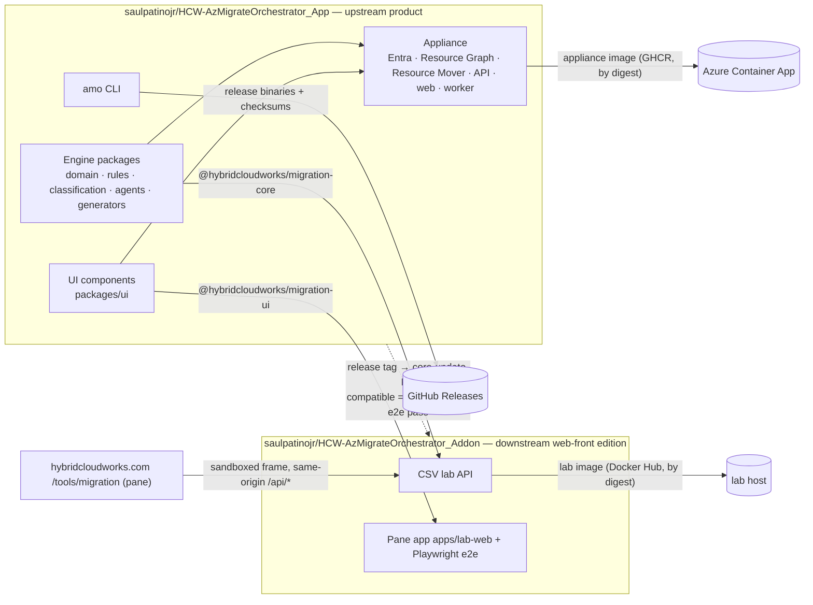

# Azure Migration Orchestrator

**Appliance and migration intelligence core — the upstream product.**

[](https://github.com/saulpatinojr/HCW-AzMigrateOrchestrator_App/actions/workflows/ci.yml)
[](https://github.com/saulpatinojr/HCW-AzMigrateOrchestrator_App/actions/workflows/security.yml)
[](https://github.com/saulpatinojr/HCW-AzMigrateOrchestrator_App/releases)
[](docs/adr/ADR-0029-node-26-runtime-floor.md)
[](docs/release/npm-publishing.md)
[](https://github.com/saulpatinojr/HCW-AzMigrateOrchestrator_App/pkgs/container/azure-migration-orchestrator-appliance)
[](LICENSE)
[](https://github.com/saulpatinojr/HCW-AzMigrateOrchestrator_Addon)

For every Azure resource in an estate, the engine answers *how it moves*: ARM move, Resource Mover, Azure Migrate or another
service, ASR (DR only), a database or data mechanism, recreate the infrastructure, migrate the data separately, rebuild
identity / network / DNS / configuration — or retain, retire, replace, redesign, escalate. Each answer carries evidence,
missing information, a confidence band, prerequisites, risks, validation and rollback steps, and generated Terraform,
PowerShell, CLI and runbooks. "Unsupported" is never the final answer.

This repository holds the **appliance** — authenticated, read-only-by-default assessment of real Azure estates with
approval-gated planning — together with the engine it is built on: taxonomy, versioned Microsoft-Learn-sourced rules,
classification, 19 bounded agents and a Safety Agent, report and infrastructure generators, the `amo` CLI and the React
explorer components. It builds and runs on its own.

> **Status:** reference implementation, not production. Sign-in, Resource Graph and Resource Mover are implemented against
> REST with fakes in tests; nothing has been validated against a live tenant yet. Every limitation is recorded in
> [`VALIDATION.md`](VALIDATION.md).

## The two repositories



| Repository | Role | Publishes |
|---|---|---|
| **`HCW-AzMigrateOrchestrator_App`** (this one) | Upstream: engine, rules, CLI, UI components, appliance. Freestanding. | `@hybridcloudworks/migration-core`, `@hybridcloudworks/migration-ui`, CLI binaries, appliance image |
| [`HCW-AzMigrateOrchestrator_Addon`](https://github.com/saulpatinojr/HCW-AzMigrateOrchestrator_Addon) | Downstream: the slim web-front edition — CSV lab API and the pane framed at hybridcloudworks.com/tools/migration. Freestanding in deployment; depends on exact versions of the two packages. | Lab image |

**Updates flow downstream.** Every release here is picked up by the addon's `core-update` workflow, which builds the
release, installs it, runs the addon's unit tests and browser e2e, and opens a pull request bumping the pin labelled
`compatible` or `needs-adaptation`. Nothing is ever consumed from `main`. The Azure clients never leave this repository,
so the addon is technically unable to reach Azure. Decision records: [ADR-0028](docs/adr/ADR-0028-appliance-upstream-web-front-downstream.md),
[ADR-0008](docs/adr/ADR-0008-hard-edition-boundary-the-demo-cannot-construct-an-azure-provider.md).

## Quick start

Requires Node 26 ([ADR-0029](docs/adr/ADR-0029-node-26-runtime-floor.md)) or the devcontainer.

```bash
npm ci && npm test                       # build, assemble the publishable packages, run 88 tests
npm run rules:validate                   # 35 rules, checksummed snapshot
npm run packages:verify                  # pack both packages and exercise them from an empty consumer project
node apps/cli/dist/main.js assess --csv samples/resources-csv/sample-resources.csv --out ./out --region westus3 --zip
npm run web:build                        # appliance web UI (Vite + React + MSAL)
docker compose -f docker-compose.appliance.yml up --build
```

PowerShell: `npm ci; npm test; npm run rules:validate; node apps/cli/dist/main.js assess --csv samples/resources-csv/sample-resources.csv --out .\out --region westus3 --zip`

No Node at run time: download `amo-linux-x64`, `amo-darwin-arm64` or `amo-windows-x64.exe` and its `SHA256SUMS-*.txt` from
the [latest release](https://github.com/saulpatinojr/HCW-AzMigrateOrchestrator_App/releases/latest), then
`./amo-linux-x64 assess --csv inventory.csv --out ./out --region westus3`.

## Repository map

| Path | What |
|---|---|
| `packages/domain` · `contracts` · `csv-ingestion` · `evidence-engine` · [`rules/`](rules) | Taxonomy, API contracts, hardened `resources.csv` parser, versioned and checksummed rules with Microsoft Learn provenance |
| `packages/classification-engine` · `agents` · `{report,terraform,runbook,artifact}-*` | Decisions, confidence, waves; orchestrator and Safety Agent; the output bundle |
| `packages/authorization` · `workspace-provider` · `observability` · `azure-discovery` | Levels and approval gate, Coder abstraction, redacted logging, the `DiscoveryProvider` **interface** |
| `packages/ui` | The explorer components, published as `@hybridcloudworks/migration-ui` |
| `packages/azure-auth` · `azure-arm` · `azure-execution` | Entra token validation and credentials, Resource Graph / ARM validate-move / scope clients, gated Resource Mover. **Never published** |
| `apps/cli` · `apps/appliance-api` · `apps/appliance-web` · `apps/worker` | Entry points |
| `scripts/assemble-packages.mjs` → `dist-packages/` | Builds the two npm packages from the workspaces (part of `npm run build`) |
| [`infrastructure/`](infrastructure/README.md) | Appliance Dockerfile and Container Apps Terraform |
| [`docs/`](docs/README.md) | Requirement ledger, traceability, the canonical ADR log for both repositories, agents, product, release runbooks, [`WORKING-PLAN.md`](WORKING-PLAN.md) |

## Releases and artifacts

A `v*` tag publishes, only after the checks pass:

| Artifact | Where | Gate |
|---|---|---|
| Appliance image | `ghcr.io/saulpatinojr/azure-migration-orchestrator-appliance` | Built locally, scanned (Trivy, HIGH/CRITICAL fixed), then pushed with provenance and SBOM. Deploy by digest, never by tag |
| CLI binaries | GitHub Releases, three platforms, with `SHA256SUMS-*.txt` and provenance | Each binary smoke-tested (`rules validate` + a sample `assess`) |
| `@hybridcloudworks/migration-core`, `@hybridcloudworks/migration-ui` | npm, trusted publishing with provenance, no stored token | Clean-consumer gate; **pending the one-time owner bootstrap** in [`docs/release/npm-publishing.md`](docs/release/npm-publishing.md) |

Actions are pinned to commit SHAs; Dependabot keeps them current.

## Principles baked into code

Read-only default · the web-front edition is technically unable to reach Azure · infrastructure, identity, configuration
and data are decided separately · migration ≠ DR (ASR is never a default migration tool) · unknown stays unknown · low
evidence never yields high confidence · every output is labelled, hashed and traceable to rule versions · nothing
generated is "production-ready" until validated · deterministic rules decide; language models never decide.

## Contributing, security, license

[`CONTRIBUTING.md`](CONTRIBUTING.md) · [`SECURITY.md`](SECURITY.md) (private vulnerability reporting) ·
[`CODE_OF_CONDUCT.md`](CODE_OF_CONDUCT.md) · MIT ([`LICENSE`](LICENSE), [`NOTICE`](NOTICE)).
Coding-agent guidance: [`AGENTS.md`](AGENTS.md), [`CLAUDE.md`](CLAUDE.md).
